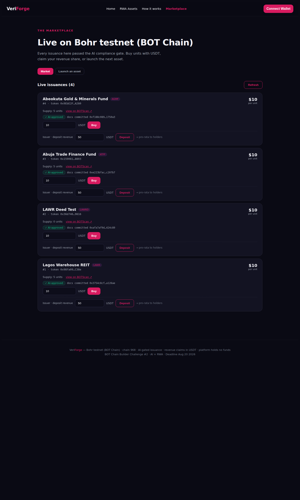

# VeriForge 🔱

**AI-gated RWA issuance on BOT Chain.**

VeriForge is the issuance and revenue layer for tokenized real-world assets on BOT Chain. An issuer documents a real asset, the VeriForge AI compliance officer reviews it and produces a dossier with a 0-100 score, and only APPROVED issuances get listed on-chain. Investors buy units with USDT, revenue is deposited into a distributor, and holders claim their pro-rata share. The platform holds no funds.

**Live on BOT mainnet (chain 677)** with real AI-gated issuances, a working
secondary market, and an on-chain price chart; the full loop is verified
on-chain. Bohr testnet (968) is also live for development.

Built for the **BOT Chain Builder Challenge #2 (AI × RWA)**.

## Why this problem

BOT Chain has a bridge, a DEX, a wallet, and a young ecosystem. What it lacks is the loop every RWA issuer needs: issue a token with real terms, sell it for USDT, distribute revenue pro-rata, and stay compliant. That loop is the whole business of the asset side, and it did not exist on the chain. VeriForge is that loop.

AI is genuinely core, not bolted on. The compliance gate is a real LLM review of the issuer's documentation. The verdict is stored on-chain in the attestation registry, and the issuance registry refuses to list anything that is not APPROVED. No human rubber stamp, no heuristic linter, no fabricated scores.

## Architecture

```
veriforge/
├── packages/
│   ├── contracts/        # Hardhat: AttestationRegistry, IssuanceRegistry, RwaToken, RevenueDistributor
│   └── shared/           # contract-addresses.json (deploy output)
└── apps/
    ├── api/              # Fastify + x402 gate + AI compliance gate + issuance pipeline
    └── web/              # Next.js: market, buy units, claim revenue, launch an asset
```

## Contract design (mainnet-safe)

| Contract | Role | Funds |
|---|---|---|
| `AttestationRegistry` | Stores AI verdicts, verifier-only writes | holds none |
| `IssuanceRegistry` | Lists issuances, enforces the AI gate on-chain | holds none |
| `RwaToken` | ERC-20 units, buy() pulls USDT to the issuer | holds none |
| `RevenueDistributor` | Pull-based pro-rata claims, no admin | holds only unclaimed |

The IssuanceRegistry calls the AttestationRegistry and reverts with `NotApproved` unless the token carries an APPROVED verdict. The gate is enforced in the contract, not just in the API.

## The AI gate

`apps/api/src/compliance.ts` sends the issuer's documentation to a real LLM and parses a structured dossier. Score >= 70 is APPROVED, 40-69 CAUTION, < 40 BLOCKED. If the LLM is unreachable the request fails loudly. No documentation at all scores 0 automatically. The gate runs on **Gemini** (`GEMINI_API_KEY` / `GEMINI_MODEL`, default `gemini-3.7-flash`) with an **OpenRouter fallback rail** (`OPENROUTER_API_KEY`, `gpt-4o-mini`) so approvals still land even when the free-tier daily quota is exhausted; blank `GEMINI_API_KEY` to force the fallback. The dossier records which model produced the verdict — no silent substitution. The verdict is stored on-chain in the AttestationRegistry and visible on every marketplace card.

## API

| Route | Fee | Purpose |
|---|---|---|
| `GET /health` | free | liveness + registry addresses |
| `GET /v1/fees` | free | fee schedule |
| `GET /v1/issuances` | free | list from on-chain registry |
| `GET /v1/issuances/:id` | free | single issuance |
| `GET /v1/issuances/:id/claimable/:holder` | free | USDT claimable by a holder |
| `GET /v1/attestations/:target` | free | AI verdict for a contract |
| `POST /v1/issuances` | 1 USDT (x402) | AI gate + deploy + attest + list |

## Quick start

```bash
# contracts
cd packages/contracts
npm install
npx hardhat test          # 27 tests

# local node + deploy (chain 677)
npx hardhat node
npx hardhat run scripts/deploy-local.ts --network localhost

# api
cd ../../apps/api
cp .env.example .env      # set VERIFIER_PRIVATE_KEY, X402_PAY_TO, FREEMODEL_API_KEY
npm run dev               # :4000

# web
cd ../web
cp .env.local.example .env.local
npm run dev               # :3000
```

Production-style local stack (systemd, survives reboot):

```bash
sudo cp deploy/veriforge-*.service /etc/systemd/system/
sudo systemctl daemon-reload
sudo systemctl enable --now veriforge-node veriforge-api veriforge-web
cd packages/contracts && npx hardhat run scripts/deploy-local.ts --network localhost
```

Deploy to a public BOT Chain (verified on Bohr testnet 968):

```bash
cd packages/contracts
export DEPLOYER_PRIVATE_KEY=<key> BOT_TESTNET_RPC=https://rpc.bohr.life
npx hardhat run scripts/deploy.ts --network botchain-testnet

# mainnet (needs a funded wallet with real BOT)
npx hardhat run scripts/deploy.ts --network botchain
```

## Live deployments (verified 2026-08-19)

### BOT mainnet (chain 677) — live
- RPC `https://rpc.botchain.ai`, chain 677, explorer `https://scan.botchain.ai`
- USDT: `0xaBabc7Ddc03e501d190C676BF3d92ef0e6e87a3C`
- AttestationRegistry: `0xF7ed39F4401062d9A5c45B7583d299887c5Cd560` ([verified source](https://scan.botchain.ai/address/0xF7ed39F4401062d9A5c45B7583d299887c5Cd560#code))
- IssuanceRegistry: `0x9369c520DcE7DA60aB9B0EafcD618d8F3416ae65` ([verified source](https://scan.botchain.ai/address/0x9369c520DcE7DA60aB9B0EafcD618d8F3416ae65#code))

### Bohr testnet (chain 968) — live
- RPC `https://rpc.bohr.life`, chain 968, explorer `https://scan.bohr.life`
- USDT: `0x75edC9335175Fc0552D51D48439F229c10420fe3` (faucet: `https://faucet.botchain.ai/basic`)
- AttestationRegistry: `0x569ab13814bb10A0E661a1993c6372b40eEab57d` ([verified source](https://scan.bohr.life/address/0x569ab13814bb10A0E661a1993c6372b40eEab57d#code))
- IssuanceRegistry: `0x2011C677a4EF5859975c54E593252a7b868a7269` ([verified source](https://scan.bohr.life/address/0x2011C677a4EF5859975c54E593252a7b868a7269#code))

Both chains share the deployer/verifier wallet `0x73b16058d57a6337060677496d4A8e97A9554539`. Live issuances per chain are listed by `GET /v1/issuances?chainId=<id>` — **the web has a Testnet/Mainnet toggle in the header** that switches the whole app (wallet network, reads, x402 payments) between 677 and 968.

Full e2e loop executed on Bohr: x402 pay (1 USDT) → AI gate → deploy → list → buy units for USDT → issuer deposits revenue → holder claims. The same pipeline runs on mainnet once the buyer pays the x402 fee on chain 677.

## Official BOT Chain integration

Verified against the [BOT Chain Project Integration Guide](https://dev-docs.botchain.ai/docs/Developers/quick-guide/): contracts deployed via Hardhat on the official RPC, verified on BOTScan, standard EVM tooling (ethers v6). The stack is fully env-driven, so mainnet is a config change away.

| Resource | Link |
|---|---|
| Testnet faucet | https://faucet.botchain.ai |
| Dev docs / quick guide | https://dev-docs.botchain.ai/docs/Developers/quick-guide/ |
| BOTScan (testnet / mainnet) | https://scan.bohr.life / https://scan.botchain.ai |
| Official DEX | https://dex.botchain.ai/#/swap |
| Cross-chain bridge | https://bridge.botchain.ai |
| Official wallet | https://wallet.botchain.ai |
| CertiK audits | https://www.botchain.ai/docs/Chain.pdf |

**Official contracts (per the guide):** WBOT `0xD5452816194a3784dBa983426cCe7c122F4abd30` · mainnet USDT `0xaBabc7Ddc03e501d190C676BF3d92ef0e6e87a3C` · BDEX Universal Router mainnet `0xaE6ae8630f7A888dEc0B9195C85F7515d5887655` / testnet `0x73Be0A1d8011B335A7aBeF6c45544E8ca4448AB5` · ERC-4337 bundler mainnet `https://bundler.botchain.ai/rpc` / testnet `https://bundler.bohr.life/rpc` · live BOT price `https://api.coinstore.com/api/v1/ticker/price;symbol=BOTUSDT`.

**Dual-chain:** the API serves both chains (`chainId=677|968` query param; the x402 gate resolves the chain the buyer pays on). The web toggle switches networks at runtime — no redeploy needed to change network. Chain config lives in `apps/api/src/chains.ts` and `apps/web/src/lib/chains.ts` (per-chain RPC/USDT/explorer hardcoded, overridable via `BOT_MAINNET_*` / `BOT_TESTNET_*` env).

## Web

Next.js 15 + RainbowKit (wagmi v2) wallet model. BOT Chain 968/677 is a
first-class wagmi chain, so connect, chain switch, and account state are all
provider-managed — no raw `window.ethereum` plumbing. The web calls the API
directly at `NEXT_PUBLIC_API_URL` (CORS-enabled), so it deploys on any static
host (Netlify, Vercel) with no proxy requirement.

**Live frontend: https://veri-forge.netlify.app** (deployed statically, talks
to the live API). Visit the **Marketplace** → toggle **Mainnet** to see the
live LLWF issuance with its on-chain candle chart.



| Flow | Path |
|---|---|
| Launch an asset (docs → AI gate → deploy → list) | Launch tab, 1 USDT via x402 |
| Buy units with USDT | Market tab, wallet-signed approve + buy |
| Deposit revenue | Market tab, issuer row |
| Claim pro-rata share | Market tab, holder row |

## Secondary market — investors earn two ways (shipped)

Each issuance now deploys a per-asset **SecondaryMarket** (a constant-product
liquidity pool) alongside its token and revenue distributor, so units trade at
a **demand-driven market price** on top of the fixed primary issuance:

- **Price appreciation** — buying demand pushes the unit price up, so early
  investors can sell at a gain.
- **Two independent earnings rails** — revenue yield (via `RevenueDistributor`)
  **plus** capital appreciation, decoupled from each other.
- **How it works** — the issuer seeds the pool (token units + USDT) to set the
  start price; then anyone can **Buy** or **Sell** at the live price. The
  constant-product curve means buys raise the price and sells lower it —
  a real market, not a fixed price.
- **Trade UI** — each card shows the live price and a Buy/Sell control (issuer
  sees a Seed control until the pool is seeded).
- Contract: `SecondaryMarket.sol` (**34 contract tests passing**, incl. the
  demand-driven price tests and the on-chain price-history / candle-feed test).

Design goal met: the clean primary raise (payment to issuer) is unchanged; the
market sits on top, so investors earn from **both** project revenue and price
increase.

## Live mainnet state (verified on-chain, chain 677)

Mirrored by the API's `/v1/issuances?chainId=677` and visible in the web
Marketplace on the **Mainnet** toggle. As of this read:

- **IssuanceRegistry (`0x9369…65`): real mainnet issuances live**, deduplicated
  in the API so the marketplace shows **one clean card per asset** — the most
  active live issuance (chart-capable new contract + real supply) wins.
- **LLWF (Lagos Logistics Warehouse Fund) — live on mainnet** with a
  **new-contract SecondaryMarket** that records **on-chain price history** and
  renders a **live candlestick / K-line chart** on the card:
  - Primary **$10.00/unit**; secondary market seeded at $10, then traded to a
    live price by real demand (the on-chain chart shows the candle history).
  - **AI gate · 100/100 · APPROVED**, committed docs payloadHash on-chain.
  - Full loop executed on mainnet: x402 pay → AI gate → deploy → list → buy →
    revenue → claim → **seed + trade the secondary market**.

## Web — both primary and secondary, clearly labeled

Each marketplace card now separates the two rails with clear headers:

- **• Primary issuance · buy units for USDT** — fixed offering price, with a
  live **units preview** (`≈ X.XXXX units`) as you type a USDT amount.
- **• Secondary market · trade at live price** — live demand-driven price,
  on-chain candle chart (grid, price axis, time axis, volume, candlesticks),
  and Buy/Sell at market with a live units preview.

**Revenue / claim controls are role-gated and truthful:**

- The **revenue deposit row is shown only to the issuer** of that asset.
- The **Claim** button appears **only to a non-issuer holder**, and **only once
  revenue has actually been deposited** — no mock claim, no self-claim.

## Roadmap

VeriForge ships the issuance rail, the secondary market, and the on-chain
price chart today. The next upgrade keeps the "platform holds no funds" and
"AI-gated, on-chain" guarantees at the center:

### 1. Richer market data & automation
- **Market history depth** — keep on-chain price points fresh as trades land
  (the candle chart is already fed from `SecondaryMarket.priceHistory`); add a
  consolidated multi-asset overview and per-unit depth view.
- **Automated revenue verification** — cross-check the issuer's declared
  revenue against a live data source (invoicing, payment-settlement, or a
  custody/webhook feed) before a deposit is recognized, so a judge or auditor
  can see *why* a payout is legitimate — not just that it happened.
- **Automated distribution** — scheduled, push-based pro-rata payouts to
  holders (in addition to today's pull-based claims), removing the manual
  issuer-deposit step for qualifying issuers.
- **Vested / escrowed revenue** — enabled for issuers who want provable custody
  of declared earnings.

## BOT Chain facts

- Mainnet chain ID 677, RPC `https://rpc.botchain.ai`, explorer `https://scan.botchain.ai`
- USDT (bridged): `0xaBabc7Ddc03e501d190C676BF3d92ef0e6e87a3C`
- Gas paid in BOT (1 BOT per eligible project from the challenge)

## Track fit

- **RWA Applications** (highest priority): asset distribution and asset management are named directions
- **AI Native**: the AI compliance gate is the on-chain decision entity, verdicts written on-chain, not a chat wrapper
- **Deep mainnet integration**: the registry pair is a real deployment with **live issuances on 677**, not a demo
